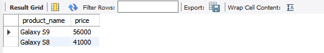

# Семинар 1

## Задание 1

- Создайте таблицу с мобильными телефонами, используя графический интерфейс.  
- Заполните БД данными  

### 1.1 Создание таблицы

#### С помощью графического интерфейса


#### Код

```sql
USE mobale
CREATE TABLE mobale_phones (
  id_phone INT NOT NULL AUTO_INCREMENT,
  product_name VARCHAR(45) NOT NULL DEFAULT unknow,
  manufacturer VARCHAR(45) NOT NULL DEFAULT 'unknow',
  product_count INT NOT NULL DEFAULT 0,
  price INT NOT NULL DEFAULT 0,
  PRIMARY KEY (id_phone));  
```  

### 1.2 Заполнение данными

```sql
USE mobale ;
insert into mobale_phones (product_name, manufacturer, product_count, price)
values
('iPhone X', 'Apple', 3, 76000),
('iPhone 8', 'Apple', 2, 51000),
('Galaxy S9', 'Samsung', 2, 56000),
('Galaxy S8', 'Samsung', 1, 41000),
('P20 Pro', 'Huawei', 5, 36000);
```


## Задание 2

- Выведите название, производителя и цену для товаров, количество которых превышает 2

```sql
USE mobale;
select product_name, manufacturer, price 
from mobale_phones 
where product_count > 2;
```


## Задание 3

- Выведите весь ассортимент товаров марки Samsung

```sql
USE mobale ;
select product_name, price 
from mobale_phones 
where manufacturer = 'Samsung';
```



## Задание 4

- Найти с помощью регулярных выражений:

### 4.1 Товары, в которых есть упоминание "Iphone"

```sql
use mobale;
select *
from mobale_phones
where product_name regexp 'iphone';
```


### 4.2 Товары, в которых есть упоминание "Samsung"

```sql
use mobale;
select *
from mobale_phones
where manufacturer regexp 'Samsung';
```


### 4.3  Товары, в которых есть ЦИФРЫ

```sql
use mobale;
select *
from mobale_phones
where product_name regexp '[0-9]';
```


### 4.4  Товары, в которых есть ЦИФРА 8

```sql
use mobale;
select *
from mobale_phones
where product_name regexp '8';
```


